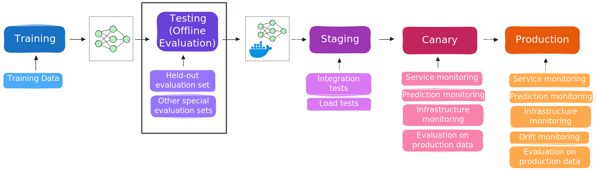

# Offline evaluation of ML systems

In this tutorial, we will practice selected techniques for evaluating machine learning systems, and then monitoring them in production.

The lifecycle of a model may look something like this:

* **Training**: Initially, a model is trained on some training data
* **Testing** (offline): If training completes successfully, the model progresses to a testing - offline evaluation - stage. In this stage, it is evaluated using a held-out evaluation set not used in training, and potentially other special evaluation sets (as we'll see in this tutorial).
* **Staging**: Given satisfactory performance on the offline evaluation, the model may be *packaged* as part of a service, and then this package promoted to a staging environment that mimics the "production" service but without live users. In this staging environmenmt, we can perform integration tests against the service and also load tests to evaluate the inference performance of the system.
* **Canary** (or blue/green, or other "preliminary" live environment): From the staging environment, the service can be promoted to a canary or other preliminary environment, where it gets requests from a small fraction of live users. In this environment, we are closely monitoring the service, its predictions, and the infrastructure for any signs of problems. We will try to "close the feedback loop" so that we can evaluate how effective our model is on production data, and potentially, evaluate the system on business metrics.
* **Production**: Finally, after a thorough offline and online evaluation, we may promote the model to the live production environment, where it serves most users. We will continue monitoring the system for signs of degradation or poor performance.

In this particular section, we will evaluate a model in the *offline* testing stage - when it is not yet deployed as a "live" service accepting requests from real users. 



To run this experiment, you should have already created an account on Chameleon, and become part of a project. You should also have added your SSH key to the KVM@TACC site.


## Experiment resources 

For this experiment, we will provision one virtual machine on KVM@TACC.


## Open this experiment on Trovi

When you are ready to begin, you will continue with the next step, in which you bring up and configure a VM instance! To begin this step, open this experiment on Trovi:

* Use this link: [Offline evaluation of ML systems](https://chameleoncloud.org/experiment/share/3785c5f5-4c98-4dae-b66d-9e693544a269) on Trovi
* Then, click “Launch on Chameleon”. This will start a new Jupyter server for you, with the experiment materials already in it, including the notebok to bring up the VM instance.


## Launch and set up a VM instance- with python-chi

We will use the `python-chi` Python API to Chameleon to provision our VM server. 

We will execute the cells in this notebook inside the Chameleon Jupyter environment.

Run the following cell, and make sure the correct project is selected. 


```python
from chi import server, context
import chi, os, time, datetime

context.version = "1.0" 
context.choose_project()
context.choose_site(default="KVM@TACC")
```


We will use bring up a `m1.medium` flavor server with the `CC-Ubuntu24.04` disk image. 

> **Note**: the following cell brings up a server only if you don't already have one with the same name! (Regardless of its error state.) If you have a server in ERROR state already, delete it first in the Horizon GUI before you run this cell.


```python
username = os.getenv('USER') # all exp resources will have this prefix
s = server.Server(
    f"node-eval-offline-{username}", 
    image_name="CC-Ubuntu24.04",
    flavor_name="m1.medium"
)
s.submit(idempotent=True)
```


Then, we'll associate a floating IP with the instance:


```python
s.associate_floating_ip()
```

```python
s.refresh()
s.check_connectivity()
```


In the output below, make a note of the floating IP that has been assigned to your instance (in the "Addresses" row).


```python
s.refresh()
s.show(type="widget")
```


By default, all connections to VM resources are blocked, as a security measure.  We need to attach one or more "security groups" to our VM resource, to permit access over the Internet to specified ports.

The following security groups will be created (if they do not already exist in our project) and then added to our server:


```python
security_groups = [
  {'name': "allow-ssh", 'port': 22, 'description': "Enable SSH traffic on TCP port 22"},
  {'name': "allow-8888", 'port': 8888, 'description': "Enable TCP port 8888 (used by Jupyter)"}
]

```


```python
# configure openstacksdk for actions unsupported by python-chi
os_conn = chi.clients.connection()
nova_server = chi.nova().servers.get(s.id)

for sg in security_groups:

  if not os_conn.get_security_group(sg['name']):
      os_conn.create_security_group(sg['name'], sg['description'])
      os_conn.create_security_group_rule(sg['name'], port_range_min=sg['port'], port_range_max=sg['port'], protocol='tcp', remote_ip_prefix='0.0.0.0/0')

  nova_server.add_security_group(sg['name'])

print(f"updated security groups: {[group.name for group in nova_server.list_security_group()]}")
```


### Retrieve code and notebooks on the instance

Now, we can use `python-chi` to execute commands on the instance, to set it up. We'll start by retrieving the code and other materials on the instance.


```python
s.execute("git clone https://github.com/teaching-on-testbeds/eval-offline-chi")
```


### Set up Docker

Here, we will set up the container framework.


```python
s.execute("curl -sSL https://get.docker.com/ | sudo sh")
s.execute("sudo groupadd -f docker; sudo usermod -aG docker $USER")
```


## Open an SSH session

Finally, open an SSH sesson on your server. From your local terminal, run

```
ssh -i ~/.ssh/id_rsa_chameleon cc@A.B.C.D
```

where

* in place of `~/.ssh/id_rsa_chameleon`, substitute the path to your own key that you had uploaded to KVM@TACC
* in place of `A.B.C.D`, use the floating IP address you just associated to your instance.


## Prepare data

For the rest of this tutorial, we'll be evaluating models on the [Food-11 dataset](https://www.epfl.ch/labs/mmspg/downloads/food-image-datasets/). We're going to prepare a Docker volume with this dataset already prepared on it, so that the containers we create later can attach to this volume and access the data. 


First, create the volume:

```bash
# runs on node-eval-offline
docker volume create food11
```

Then, to populate it with data, run

```bash
# runs on node-eval-offline
docker compose -f eval-offline-chi/docker/docker-compose-data.yaml up -d
```

This will run a temporary container that downloads the Food-11 dataset, organizes it in the volume, and then stops. It may take a minute or two. You can verify with 

```bash
# runs on node-eval-offline
docker ps
```

that it is done - when there are no running containers.

Finally, verify that the data looks as it should. Start a shell in a temporary container with this volume attached, and `ls` the contents of the volume:

```bash
# runs on node-eval-offline
docker run --rm -it -v food11:/mnt alpine ls -l /mnt/Food-11/
```

it should show "evaluation", "validation", and "training" subfolders.


## Launch a Jupyter container

Inside the SSH session, start a Jupyter container:

```bash
# run on node-eval-offline
docker run  -d --rm  -p 8888:8888 \
    -v ~/eval-offline-chi/workspace:/home/jovyan/work/ \
    -v food11:/mnt/ \
    -e FOOD11_DATA_DIR=/mnt/Food-11 \
    --name jupyter \
    quay.io/jupyter/pytorch-notebook:pytorch-2.5.1
```

Run

```bash
# run on node-eval-offline
docker logs jupyter
```

and look for a line like

```
http://127.0.0.1:8888/lab?token=XXXXXXXXXXXXXXXXXXXXXXXXXXXXXXXXXXXXXXXXXXXXXXXX
```

Paste this into a browser tab, but in place of 127.0.0.1, substitute the floating IP assigned to your instance, to open the Jupyter notebook interface that is running *on your compute instance*.

Open a terminal inside this Jupyter container, and run

```bash
# run in Jupyter container on node-eval-offline
pip install grad-cam pytest
```

Then, in the file browser on the left side, open the "work" directory and then click on the `eval_offline.ipynb` notebook to continue.


## Evaluate a model offline

In this section, we will practice offline evaluation of a model! After you finish this section, you should understand how to:

* evaluate a model on general metrics for its domain
* use human judgement and explainable AI techniques to "sanity check" a model
* evaluate a model with template-based tests
* evaluate a model on slices of interest
* evaluate a model on known failure modes
* and create a test suite out of these evaluations


Let's start by loading our trained model and our test data.


```python
# runs in jupyter container on node-eval-offline
import os
import torch
from torch.utils.data import DataLoader
from torchvision import datasets, transforms
import time
import numpy as np
import matplotlib.pyplot as plt
import seaborn as sns
import random
from PIL import Image
```


```python
# runs in jupyter container on node-eval-offline
model_path = "models/food11.pth"  
device = torch.device('cuda' if torch.cuda.is_available() else 'cpu')
model = torch.load(model_path, map_location=device, weights_only=False)
_ = model.eval()  
```


```python
# runs in jupyter container on node-eval-offline
food_11_data_dir = os.getenv("FOOD11_DATA_DIR", "Food-11")
val_test_transform = transforms.Compose([
    transforms.Resize((224, 224)),
    transforms.CenterCrop(224),
    transforms.ToTensor(),
    transforms.Normalize(mean=[0.485, 0.456, 0.406], std=[0.229, 0.224, 0.225]),
])
test_dataset = datasets.ImageFolder(root=os.path.join(food_11_data_dir, 'evaluation'), transform=val_test_transform)
test_loader = DataLoader(test_dataset, batch_size=32, shuffle=False)
```


### Evaluate model on general metrics for its domain

The most basic evaluation will involve general metrics that are relevant to the specific domain. 

For example, in this case, our model is a classification model, so we will compute accuracy. But, for other models we would consider other metrics - 

* If our classification model was highly imbalanced, accuracy would not be appropriate - we would use other classifier metrics.
* If our model was a text generation model, we would consider completely different metrics, e.g. perplexity, ROUGE, BLEU
* etc.


To start, let's get the predictions of the model on the held-out test set:


```python
# runs in jupyter container on node-eval-offline
dataset_size = len(test_loader.dataset)
all_predictions = np.empty(dataset_size, dtype=np.int64)
all_labels = np.empty(dataset_size, dtype=np.int64)

current_index = 0

with torch.no_grad():
    for images, labels in test_loader:
        batch_size = labels.size(0)

        images = images.to(device)
        labels = labels.to(device)

        outputs = model(images)
        _, predicted = torch.max(outputs, 1)

        all_predictions[current_index:current_index + batch_size] = predicted.cpu().numpy()
        all_labels[current_index:current_index + batch_size] = labels.cpu().numpy()
        current_index += batch_size

```


We can use these to compute the overall accuracy:


```python
# runs in jupyter container on node-eval-offline
overall_accuracy = (all_predictions == all_labels).sum() / all_labels.shape[0] * 100
print(f'Overall Accuracy: {overall_accuracy:.2f}%')

```


We can also compute the per-class accuracy. It would be concerning if our classifier had very low accuracy for some classes, even if it has high accuracy for others. We might set a criteria that e.g. the model we deploy must have a minimum overall accuracy, and then a different minimum per-class accuracy for all classes.


```python
# runs in jupyter container on node-eval-offline
classes = np.array(["Bread", "Dairy product", "Dessert", "Egg", "Fried food",
    "Meat", "Noodles/Pasta", "Rice", "Seafood", "Soup", "Vegetable/Fruit"])
num_classes = classes.shape[0]

```


```python
# runs in jupyter container on node-eval-offline
per_class_correct = np.zeros(num_classes, dtype=np.int32)
per_class_total = np.zeros(num_classes, dtype=np.int32)

for true_label, pred_label in zip(all_labels, all_predictions):
    per_class_total[true_label] += 1
    per_class_correct[true_label] += int(true_label == pred_label)

for i in range(num_classes):
    if per_class_total[i] > 0:
        acc = per_class_correct[i] / per_class_total[i] * 100
        correct_str = f"{per_class_correct[i]}/{per_class_total[i]}"
        print(f"{classes[i]:<20} {acc:10.2f}% {correct_str:>20}")

```


And, we can use a confusion matrix to see which classes are most often confused with one another:


```python
# runs in jupyter container on node-eval-offline
conf_matrix = np.zeros((num_classes, num_classes), dtype=np.int32)
for true_label, pred_label in zip(all_labels, all_predictions):
    conf_matrix[true_label, pred_label] += 1

plt.figure(figsize=(6, 5))
sns.heatmap(conf_matrix, annot=True, fmt='d', xticklabels=classes, yticklabels=classes, cmap='Blues')
plt.xlabel('Predicted Label')
plt.ylabel('True Label')
plt.title('Confusion Matrix')
plt.xticks(rotation=45, ha='right')
plt.tight_layout()
plt.show()

```


This can help us get some insight into our model. For example, we see in the confusion matrix above that "Dessert" and "Dairy product" samples are often confused for one another.


### Use human judgement and explainable AI techniques to "sanity check" a model

Let's use our human judgement to better understand some of these errors.


```python
# runs in jupyter container on node-eval-offline

# Get random sample of Dessert and Dairy product samples that are confused for one another
dessert_index = np.where(classes == "Dessert")[0][0]
dairy_index = np.where(classes == "Dairy product")[0][0]

confused_indices = [i for i, (t, p) in enumerate(zip(all_labels, all_predictions))
                    if (t == dessert_index and p == dairy_index) or (t == dairy_index and p == dessert_index)]

sample_indices = np.random.choice(confused_indices, size=min(5, len(confused_indices)), replace=False)

# Actually, to make it easier to discuss - we will select specific samples and get those samples from the test loader
sample_indices = np.array([404, 927, 496, 435, 667])
```


```python
# runs in jupyter container on node-eval-offline

sample_images = []
start_idx = 0
for images, _ in test_loader:
    batch_size = images.size(0)
    end_idx = start_idx + batch_size
    for idx in sample_indices:
        if start_idx <= idx < end_idx:
            image = images[idx - start_idx].cpu()
            sample_images.append((idx, image))
    start_idx = end_idx
    if len(sample_images) == len(sample_indices):
        break
```


```python
# runs in jupyter container on node-eval-offline
mean = torch.tensor([0.485, 0.456, 0.406])
std = torch.tensor([0.229, 0.224, 0.225])
# Visualize those samples (undo the normalization first)
plt.figure(figsize=(12, 3))
for i, (idx, image) in enumerate(sample_images):
    image = image * std[:, None, None] + mean[:, None, None]  # unnormalize
    image = torch.clamp(image, 0, 1)
    image = image.permute(1, 2, 0)  # go from "channels, height, width" format to "height, width, channels"
    plt.subplot(1, len(sample_images), i + 1)
    plt.imshow(image)
    plt.title(f"True: {classes[all_labels[idx]]}\nPred: {classes[all_predictions[idx]]}\nIndex: {idx}")
    plt.axis('off')
plt.tight_layout()
plt.show()
```


Now we can better understand some of these errors. 

For example, sample 496 appears to be ice cream, which is both a dessert and a dairy product. Similarly, sample 927 is cheesecake, which can also be considered both dessert and a dairy product. It is not clear what the instructions to human annotators were, and whether "ice cream" and "cheesecake" are consistently labeled in the training set, or whether some annotators might have labeled these as dessert and others as dairy products. 

Having identified this problem, we can investigate further and perhaps improve our labeling instructions. We can also re-consider our choice to model this problem as a one-label classification problem, instead of a multi-label classification problem.


We can further "sanity check" a model with explainable AI techniques to better understand which features in an input sample are most influential for it prediction. This can help us find:

- if the model is making predictions based on features that *should* not be useful - this can be a sign of data leakage.
- if the model is making predictions based on features that are associated with membership in a protected class - this can be an indicator of bias or unfairness.
- if the model is not robust to spurious features - we may need to introduce more variety in the training data.

Depending on the type of data and model, we can use different explainable AI techniques. For example:

- if we are using a classical ML model on tabular data, we may use measures of feature importance
- if we are using a convolutional neural network on image data, we may use techniques like GradCAM that highlight regions of the image that are most influential
- if we are using a Transformer model on text data, we may use attention weights to show which words the model "focuses" on

and more generally, techniques such as SHAP and LIME are applicable to many types of models.

Let's try using GradCAM to highlight the parts of the image that are most influential:


```python
# runs in jupyter container on node-eval-offline
from pytorch_grad_cam import GradCAM
from pytorch_grad_cam.utils.image import show_cam_on_image
from pytorch_grad_cam.utils.model_targets import ClassifierOutputTarget

# GradCAM setup 
target_layer = model.features[-1]  
cam = GradCAM(model=model, target_layers=[target_layer])

```


```python
# runs in jupyter container on node-eval-offline

mean = torch.tensor([0.485, 0.456, 0.406])
std = torch.tensor([0.229, 0.224, 0.225])

plt.figure(figsize=(12, 3))
for i, (idx, image) in enumerate(sample_images):
    input_tensor = (image.clone() - mean[:, None, None]) / std[:, None, None]  # normalize
    input_tensor = input_tensor.unsqueeze(0)  # add batch dim

    target_category = int(all_predictions[idx])
    grayscale_cam = cam(input_tensor=input_tensor, targets=[ClassifierOutputTarget(target_category)])
    grayscale_cam = grayscale_cam[0, :]

    image_disp = image * std[:, None, None] + mean[:, None, None]  # unnormalize
    image_disp = torch.clamp(image_disp, 0, 1).permute(1, 2, 0).numpy()

    visualization = show_cam_on_image(image_disp, grayscale_cam, use_rgb=True)
    plt.subplot(1, len(sample_images), i + 1)
    plt.imshow(visualization)
    plt.title(f"True: {classes[all_labels[idx]]}\nPred: {classes[all_predictions[idx]]}\nIndex: {idx}")
    plt.axis('off')
plt.tight_layout()
plt.show()

```


Now we have gained additional insight:

* For sample 404, which is a plate of cheese, crackers, and fruit preserves, the model focuses on what appears to be a berry chevre in the corner, and concludes that this is a dessert. If we want "fruit cheese" to be classified as a dairy product, we might consider adding more samples like these to the training data.
* Sample 435 is a cheese plate that is presented in a manner more typical of desserts. The model appears to "focus" on the decoratively plated sauce or spreads, helping us understand why it considers this a dessert; we can similarly consider adding more samples like these to the training data.
* In sample 667, the model appears to "focus" on the fork, rather than the food. This is concerning, and in further evaluation, we will want to make sure that our model will be robust to utensils placed on the image.
* Similarly, in sample 927, the prediction seems to be based on a plant in the background instead of the food.


### Evaluate a model with template-based tests

In the previous part, we saw indications that the model may focus on spurious features of the image - like the fork - when we would prefer for it to focus on the actual food item.

Let's design a template-based test to help evaluate the extent to which:

* the model is robust to perturbations in the input that should *not* change the label - for example, if the background changes, or a utensil is placed alongside the food.
* and the model *does* change its label if the background or utensils stay the same, but the actual food item changes.

Inside the "templates" directory, we have prepared some images as follows:

* background images, representing the context in which a food item may be found
* "extra" items with transparent background, that may typically be found in that context. These can be overlaid on top of the background images.
* and "food" items (organized by class) with transparent background. These can also be overlaid on top of the background images.

Let's look at these now.


```python
# runs in jupyter container on node-eval-offline

TEMPLATE_DIR = "templates"

fig, axes = plt.subplots(3, 3, figsize=(8, 6))

# Random food class
food_dir = os.path.join(TEMPLATE_DIR, "food")
food_classes = [d for d in os.listdir(food_dir) if os.listdir(os.path.join(food_dir, d))]
random_class = random.choice(food_classes)
food_images = random.sample(os.listdir(os.path.join(food_dir, random_class)), 3)
food_paths = [os.path.join(food_dir, random_class, f) for f in food_images]

for i, path in enumerate(food_paths):
    axes[0, i].imshow(Image.open(path))
    axes[0, i].set_title(f"Food ({random_class})")
    axes[0, i].axis("off")

# Backgrounds
bg_dir = os.path.join(TEMPLATE_DIR, "background")
bg_images = random.sample(os.listdir(bg_dir), 3)
bg_paths = [os.path.join(bg_dir, f) for f in bg_images]

for i, path in enumerate(bg_paths):
    axes[1, i].imshow(Image.open(path))
    axes[1, i].set_title("Background")
    axes[1, i].axis("off")

# Extras
extra_dir = os.path.join(TEMPLATE_DIR, "extras")
extra_images = random.sample(os.listdir(extra_dir), 3)
extra_paths = [os.path.join(extra_dir, f) for f in extra_images]

for i, path in enumerate(extra_paths):
    axes[2, i].imshow(Image.open(path))
    axes[2, i].set_title("Extra")
    axes[2, i].axis("off")

plt.tight_layout()
plt.show()

```


and, here is a function that can compose an image out of a background, a food item, and (optionally) an extra:


```python
# runs in jupyter container on node-eval-offline

def compose_image(food_path, bg_path=None, extra_path=None):

    food = Image.open(food_path).convert("RGBA")

    if bg_path:
        bg = Image.open(bg_path).convert("RGBA")
    else:
        bg = Image.new("RGBA", food.size, (255, 255, 255, 255))

    bg_w, bg_h = bg.size
    y_offset = int(bg_h * 0.05)
            
    food_scale = 0.5
    food = food.resize((int(bg_w * food_scale), int(bg_h * food_scale)))
    
    fd_w, fd_h = food.size

    if extra_path:
        
        extra_scale = 0.35
        extra = Image.open(extra_path).convert("RGBA")
        extra = extra.resize((int(bg_w * extra_scale), int(bg_h * extra_scale)))
        ex_w, ex_h = extra.size
        bg.paste(extra, (bg_w - ex_w, bg_h - ex_h - y_offset), extra)
        
    bg.paste(food, ((bg_w - fd_w) // 2, bg_h - fd_h - y_offset), food)

    return bg.convert("RGB")
```


Let's try composing:

* a food item 
* the same food item and background, with a background and an "extra"
* the same food item, with a different background and different "extra"

These should all have the same prediction. Notice that this is a test we could even run on an *unlabeled* food item - we don't need to know the actual class (although we do, in this case).

We can also try:

* a different food item from the same class, on the same background - this should have the same predicted label
* and a food item from a different class, on the same background - this should have a different predicted label


```python
# runs in jupyter container on node-eval-offline
imgs = {
    'original_image': compose_image('templates/food/09/001.png'),
    'composed_bg1_extra1': compose_image('templates/food/09/001.png', 'templates/background/001.jpg', 'templates/extras/spoon.png'),
    'composed_bg2_extra2': compose_image('templates/food/09/001.png', 'templates/background/002.jpg', 'templates/extras/fork.png'),
    'composed_same_class': compose_image('templates/food/09/002.png', 'templates/background/001.jpg'),
    'composed_diff_class': compose_image('templates/food/05/002.png', 'templates/background/001.jpg')
}
```


and, let's look at these examples:


```python
# runs in jupyter container on node-eval-offline
fig, axes = plt.subplots(1, 5, figsize=(14, 3))

for ax, key in zip(axes, imgs.keys()):
    ax.imshow(imgs[key].resize((224,224)).crop((16, 16, 224, 224)))
    ax.set_title(f"{key}")
    ax.axis("off")

plt.tight_layout()
plt.show()
```


We can get the predictions of the model for these samples, as well as the GradCAM output -


```python
# runs in jupyter container on node-eval-offline

def predict(model, image, device=torch.device('cuda' if torch.cuda.is_available() else 'cpu')):
    model.eval()
    image_tensor = val_test_transform(image).unsqueeze(0).to(device)
    with torch.no_grad():
        image_tensor = image_tensor.to(device)
        output = model(image_tensor)
        return output.argmax(dim=1).item()

```


```python
# runs in jupyter container on node-eval-offline

fig, axes = plt.subplots(2, 5, figsize=(14, 6))

for i, key in enumerate(imgs.keys()):
    image_np = np.array(imgs[key].resize((224, 224))).astype(dtype=np.float32) / 255.0
    pred = predict(model, imgs[key])

    input_tensor = val_test_transform(imgs[key]).unsqueeze(0)
    grayscale_cam = cam(input_tensor=input_tensor, targets=[ClassifierOutputTarget(pred)])[0]
    vis = show_cam_on_image(image_np, grayscale_cam, use_rgb=True)

    axes[0, i].imshow(imgs[key].resize((224, 224)))
    axes[0, i].set_title(f"{key}\nPredicted: {pred} ({classes[pred]})")
    axes[0, i].axis("off")

    axes[1, i].imshow(vis)
    axes[1, i].axis("off")

plt.tight_layout()
plt.show()
```


That seemed OK - but let's try it for a different combination of food item, background, and "extra" item: 


```python
# runs in jupyter container on node-eval-offline

imgs = {
    'original_image': compose_image('templates/food/10/001.png'),
    'composed_bg1_extra1': compose_image('templates/food/10/001.png', 'templates/background/003.jpg', 'templates/extras/plastic_fork.png'),
    'composed_bg2_extra2': compose_image('templates/food/10/001.png', 'templates/background/002.jpg', 'templates/extras/fork.png'),
    'composed_same_class': compose_image('templates/food/10/002.png', 'templates/background/003.jpg'),
    'composed_diff_class': compose_image('templates/food/05/003.png', 'templates/background/003.jpg')
}

```


and repeat the visualization:


```python
# runs in jupyter container on node-eval-offline

fig, axes = plt.subplots(2, 5, figsize=(14, 6))

for i, key in enumerate(imgs.keys()):
    image_np = np.array(imgs[key].resize((224, 224))).astype(dtype=np.float32) / 255.0
    pred = predict(model, imgs[key])

    input_tensor = val_test_transform(imgs[key]).unsqueeze(0)
    grayscale_cam = cam(input_tensor=input_tensor, targets=[ClassifierOutputTarget(pred)])[0]
    vis = show_cam_on_image(image_np, grayscale_cam, use_rgb=True)

    axes[0, i].imshow(imgs[key].resize((224, 224)))
    axes[0, i].set_title(f"{key}\nPredicted: {pred} ({classes[pred]})")
    axes[0, i].axis("off")

    axes[1, i].imshow(vis)
    axes[1, i].axis("off")

plt.tight_layout()
plt.show()
```


Now we can see that our model is not nearly as robust as we might want it to be. We can see that some perturbations that should *not* change the model output do, and the model sometimes focuses on spurious items like the background or extra items that happen to be alongside the food in the image.

This type of test can be automated - we can collect a large number of food items, background, and "extras" and systematically evaluate this robustness as part of a test suite. We'll get to that a little bit later, though.


### Evaluate a model on slices of interest

Next, let's evaluate our model on slices of interest. This will help us understand:

* if there is a fairness or bias issue in our model - if we evaluate the performance of the model on different groups, it will help us identify potential unfairness.
* if our model is accurate enough on high-priority use cases.

For example, our model is reasonably accurate on "Dessert" samples. However, looking at some samples from this class:


```python
# runs in jupyter container on node-eval-offline
dessert_index = np.where(classes == "Dessert")[0][0]
dessert_images = []

for images, labels in test_loader:
    for img, label in zip(images, labels):
        if label.item() == dessert_index:
            dessert_images.append(img)
        if len(dessert_images) == 20:
            break
    if len(dessert_images) == 20:
        break

fig, axes = plt.subplots(4, 5, figsize=(10, 10))
for ax, img in zip(axes.flat, dessert_images):
    img = img * torch.tensor([0.229, 0.224, 0.225]).view(3,1,1) + torch.tensor([0.485, 0.456, 0.406]).view(3,1,1)
    img = torch.clamp(img, 0, 1)
    ax.imshow(img.permute(1, 2, 0).numpy())
    ax.set_title("Dessert")
    ax.axis("off")

plt.tight_layout()
plt.show()
```


we can see that these are mostly Western-style desserts. 

To evaluate whether our model is similarly effective at classifying food items from other cuisines, we might compile one or more test suites with non-Western food items. The images in the "indian_dessert" directory are also desserts - 


```python
# runs in jupyter container on node-eval-offline

dessert_dir = "indian_dessert"
dessert_images = random.sample(os.listdir(dessert_dir), 5)
fig, axes = plt.subplots(1, 5, figsize=(10, 3))

for ax, img_name in zip(axes, dessert_images):
    path = os.path.join(dessert_dir, img_name)
    image = Image.open(path).convert("RGB")
    pred = predict(model, image)
    ax.imshow(image.resize((224, 224)).crop((16, 16, 224, 224)))
    ax.set_title(f"Predicted: {pred}\n({classes[pred]})")
    ax.axis("off")

plt.tight_layout()
plt.show()

```


but our model has much less predictive accuracy on *these* dessert samples.


### Evaluate a model on known failure modes

We might also consider evaluating a model on "known" failure modes - if a model has previously failed on a specific type of image, especially in a high-profile way, we will want to set up a test so that future versions of the model will be evaluated against this type of failure.

For example: Suppose that there is a trend on social media of making cakes that look like other items. This has been a high-profile failure for GourmetGram in the past, when users upload e.g. a photo of a cake that looks like (for example...) a stick of butter, and it is tagged as "Dairy product" instead of "Dessert".

We could compile a set of test images related to this failure mode, and set it up as a separate test.


All of the photos in the "cake_looks_like" directory are actually photos of cake:


```python
# runs in jupyter container on node-eval-offline
cake_dir = "cake_looks_like"
cake_images = random.sample(os.listdir(cake_dir), 5)
fig, axes = plt.subplots(1, 5, figsize=(10, 3))

for ax, img_name in zip(axes, cake_images):
    path = os.path.join(cake_dir, img_name)
    image = Image.open(path).convert("RGB")
    pred = predict(model, image)
    ax.imshow(image.resize((224, 224)).crop((16, 16, 224, 224)))
    ax.set_title(f"{img_name}, Predicted: {pred}\n({classes[pred]})")
    ax.axis("off")

plt.tight_layout()
plt.show()
```


but, our model has a much lower accuracy on these samples than it did overall or on the general "Dessert" category.


### Create a test suite

Finally, let's create a non-interactive test suite that we can run each time we re-train a model. We'll use `pytest` as a unit test framework. Our test scripts are in "tests". Open these Python files to review then.

Inside our "conftest.py", we have some functions that are "fixtures". These provide some shared context for the tests. We have defined:

* `model`, which loads the saved model 
* `test_data`, which sets up the test data loader
* `predictions`, which gets the model predictions on the test set
* and we also define `predict` and `transform` functions so that we can use them throughout the test suite without having to repeat them in multiple files.

Then, we can pass `model`, `test_data`, and/or `predictions` to any of our test functions - these fixture functions will run only *once* and then provide their values to all test cases in a session. Similarly, we can pass `predict` to a test function and it will then be able to call our already-defined predict function.

Next, we have the test functions, which mirror what we have done in this notebook - but now, we have defined criteria for passing. A test function raises an exception if the criteria for passing are not met:

* `test_overall_accuracy` passes if the overall accuracy is greater than 85%
* `test_per_class_accuracy` passes if accuracy is greater than 75% for every individual class
* `test_template_permutations` generates combinations of "composed" images using the template: food item, extra item, and background. It passes if 80% are predicted correctly.
* `test_cake_looks_like_accuracy` and `test_indian_dessert_accuracy` each pass if accuracy is greater than 60% on the corresponding sets of images.

Of course, in a realistic setting, we would have a more comprehensive series of tests (e.g. we would have many more templates; we would evaluate the model on other forms of non-Western cuisine and not only Indian desserts, etc.). This is just a demonstration of how these tests would be automated.

Once we have defined these tests, we can run our test suite with:


```python
# runs in jupyter container on node-eval-offline
!pytest --verbose --tb=no tests/
```


where:

* `--verbose` will report the result of every test, not just the ones that fail
* `--tb=no` says not to print a traceback for every failed test
* and `pytest` will automatically discover and run every function that starts with `test_` in this directory


We have only scratched the surface with `pytest`. For example, we can re-run the tests that failed in the last run with `--lf`:


```python
# runs in jupyter container on node-eval-offline
!pytest --verbose --lf --tb=no tests/
```


or we can run only the tests from a particular test file:


```python
# runs in jupyter container on node-eval-offline
!pytest --verbose --tb=no tests/test_food11_test_cases.py
```


You can learn more about its capabilities in its [documentation](https://docs.pytest.org/en/stable/index.html).


---

When you are finished with this section - save and then download the fully executed notebook from the Jupyter container environment for later reference. (Note: because it is an executable file, and you are downloading it from a site that is not secured with HTTPS, you may have to explicitly confirm the download in some browsers.)


## Delete resources

When we are finished, we must delete the VM server instance to make the resources available to other users.

We will execute the cells in this notebook inside the Chameleon Jupyter environment.

Run the following cell, and make sure the correct project is selected. 


```python
from chi import server, context
import chi, os, time, datetime

context.version = "1.0" 
context.choose_project()
context.choose_site(default="KVM@TACC")
```


```python
username = os.getenv('USER') # all exp resources will have this prefix
s = server.get_server(f"node-eval-offline-{username}")
s.delete()
```


<hr>

<small>Questions about this material? Contact Fraida Fund</small>

<hr>

<small>This material is based upon work supported by the National Science Foundation under Grant No. 2230079.</small>

<small>Any opinions, findings, and conclusions or recommendations expressed in this material are those of the author(s) and do not necessarily reflect the views of the National Science Foundation.</small>


<hr>

<small>Questions about this material? Contact Fraida Fund</small>

<hr>

<small>This material is based upon work supported by the National Science Foundation under Grant No. 2230079.</small>

<small>Any opinions, findings, and conclusions or recommendations expressed in this material are those of the author(s) and do not necessarily reflect the views of the National Science Foundation.</small>